<h1 align="center">
	<a href="https://github.com/Darguima/SpotHack">
		
	</a>
</h1>

<h2 align="center">
	SpotHack
</h2>

<p align="center">
SpotHack is a project where you can convert your Spotify Playlists to .mp3 files saved in your devices. Download your favorites musics and playlists to listen when you are offline. SpotHack is also an open-source project so is possible anyone help since reporting bugs, writing code, documentation, giving ideas or just checking the <a href="https://www.github.com/Darguima/SpotHack">homepage</a>
</p>

<br/>

<p align="center">
	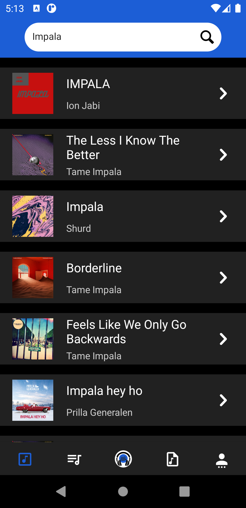
	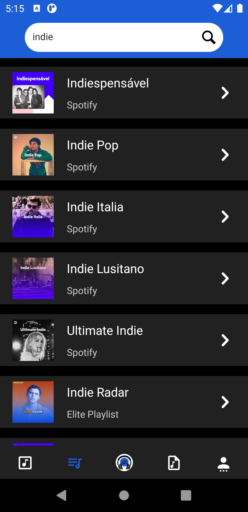
	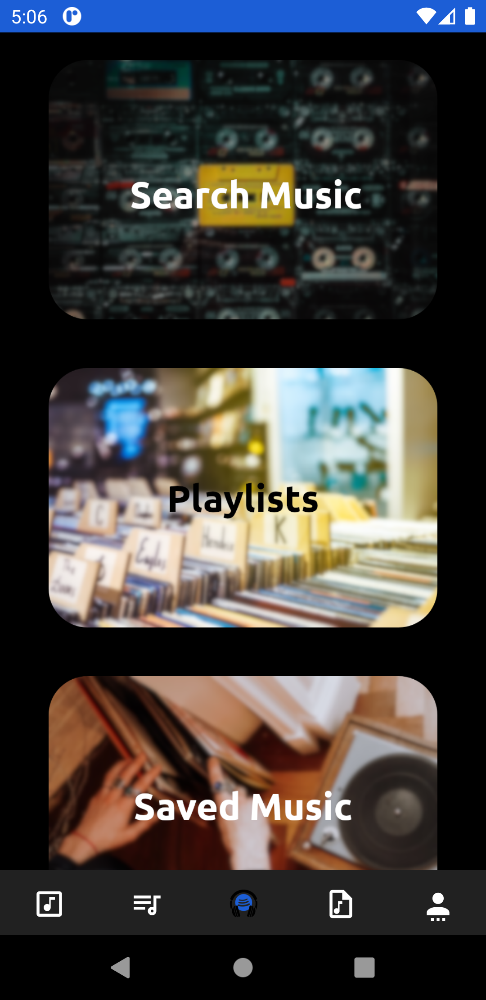
	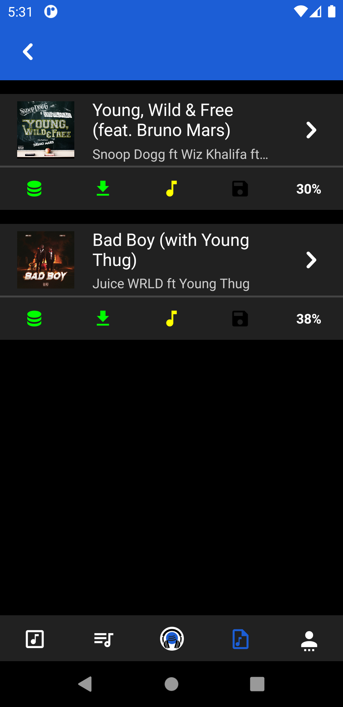
	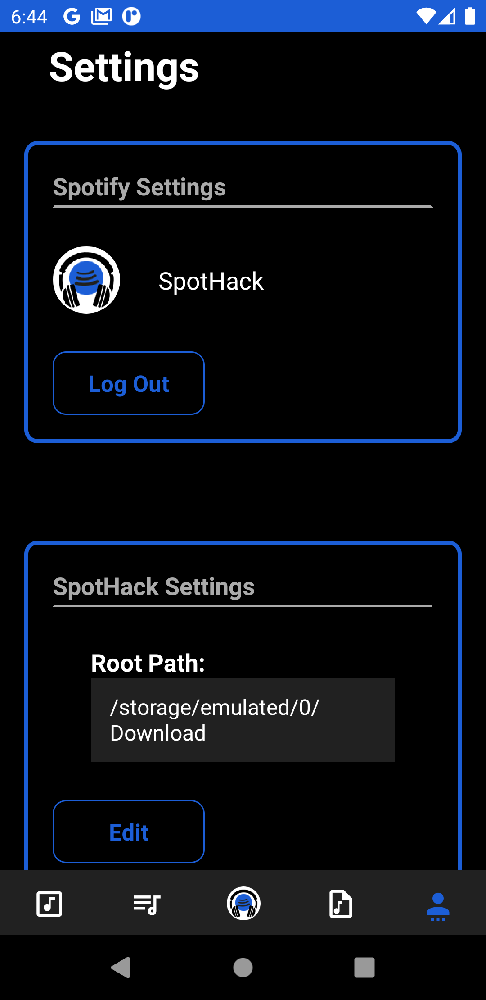
</p>

---

## Table of Contents

- [Getting Started](#getting-started)
- [Pages/Features](#pages/features)
- [Technologies Used](#technologies-used)
- [License](#license)

---

## Getting Started

### Prerequisites

- `Git` to clone the repository;

- `Yarn` to install dependencies;

- For run the project you will need the `React Native` Environment configured. You can follow the [ReactNative Official Documentation](https://reactnative.dev/docs/environment-setup) - (Change to `React Native CLI Quickstart`);

- This project was only tested and developed for Android, so I don't know if it works properly in IOS. Is recommended that you run it in an `Android Phone`;

### Cloning

- To start you can clone this repository to your local machine using:

> `git clone https://github.com/Darguima/SpotHack.git`

### Go to the mobile directory

- SpotHack should support a different number of platforms so you should go to the `mobile` directory

> `cd mobile`

### Installing Dependencies

- Now you can install all the dependencies with yarn:

> `yarn`

### Set credentials for third-party APIs

- The project uses 3 third-party APIs: Spotify Api (Web Api), Youtube Api (YouTube Data API v3), Firebase (Realtime Database)

#### Spotify Api (Web Api)

1. Create the file `./src/services/spotify/spotifyApiCredentials.json`
2. Copy the Client Id and the Client Secret from your [App Dashboard](https://developer.spotify.com/dashboard/applications)
3. Base64 encode the Client Id with the Client Secret - `${client_id}:${client_secret}`
4. Write the tokens in the file just like this object

```
{
  "client_id": "",
  "base64_key": ""
}
```

#### Youtube Api (YouTube Data API v3)

1. Create the file `./src/services/youtube/youtubeApiCredentials.json`
2. Copy the key available on the [Google Cloud Platform Credentials page](https://console.cloud.google.com/apis/credentials)
3. Write the tokens in the file just like this object

```
{
  "key": ""
}
```

#### Firebase (Realtime Database)

1. Create the file `./src/services/firebase/firebaseConfig.json`
2. Copy the required tokens from the `Firebase SDK snippet` on the `Project's Configuration` Page
3. Write the tokens in the file just like this object

```
{
    "apiKey": "",
    "authDomain": "",
    "databaseURL": "",
    "projectId": "",
    "storageBucket": "",
    "messagingSenderId": "",
    "appId": ""
  }
```

### Setup

- To setup the application you can use:

> `yarn android`

> `yarn start`

---

## Pages/Features

### Landing Page


* In the Landing Page, for now, we don't have nothing very important, only some shortcuts to the others pages

___

### Search Music Page / Music Detail Page

<div>
	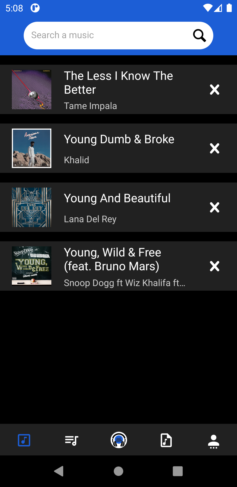
	
	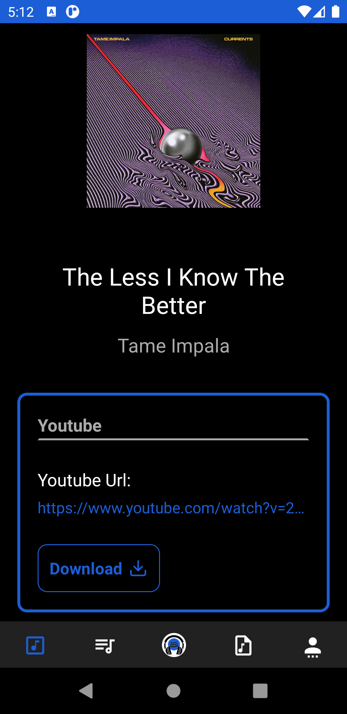
	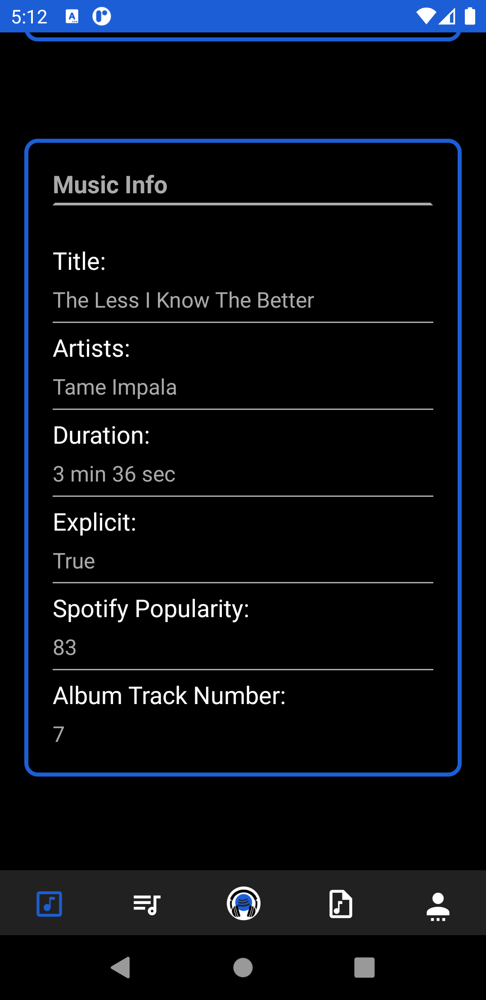
	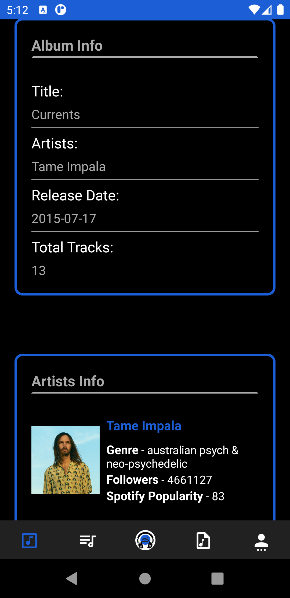
</div>

* Here is where you can search for musics (search is done by Spotify)
* All selected songs will be saved in a history to be re-accessed later
* The music details page provides you all the information, the Youtube Url and the download button 
---

### Search Music Page / Music Detail Page

<div>
	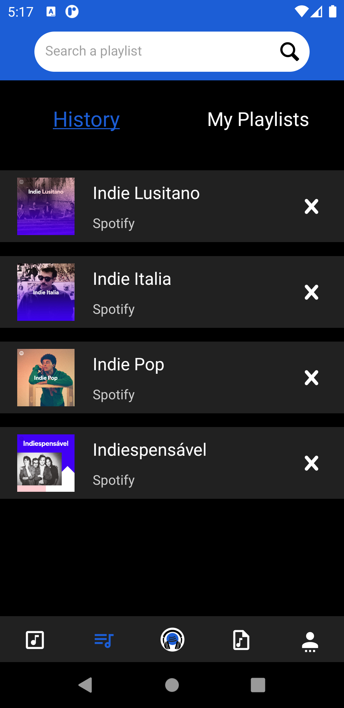
	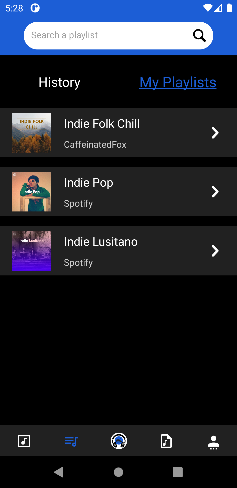
	
</div>
<div>
	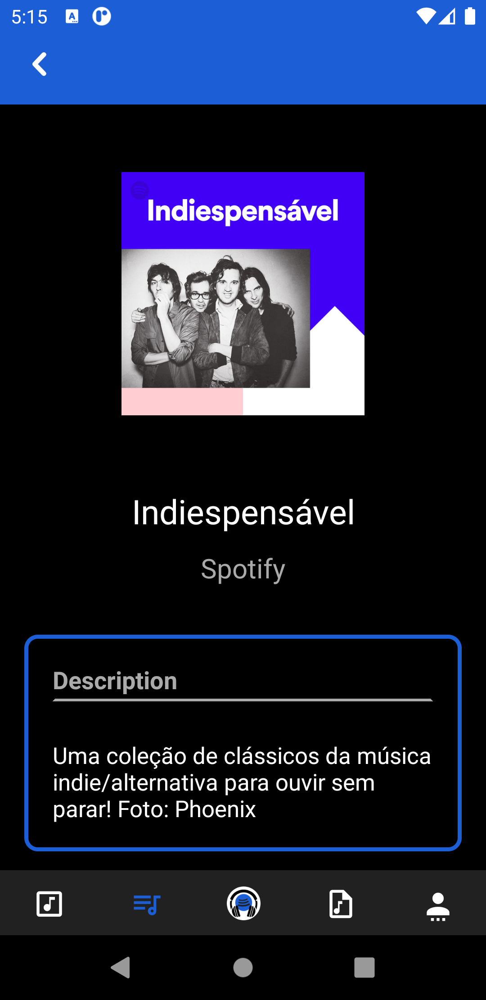
	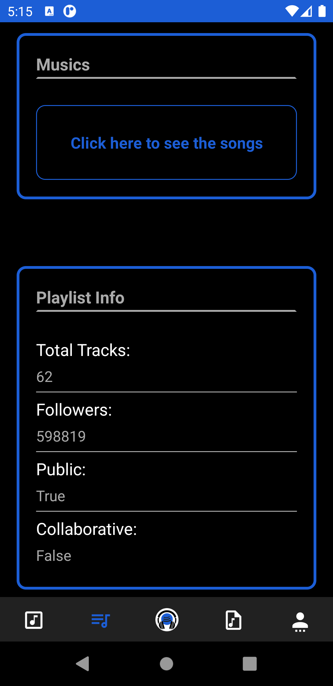
	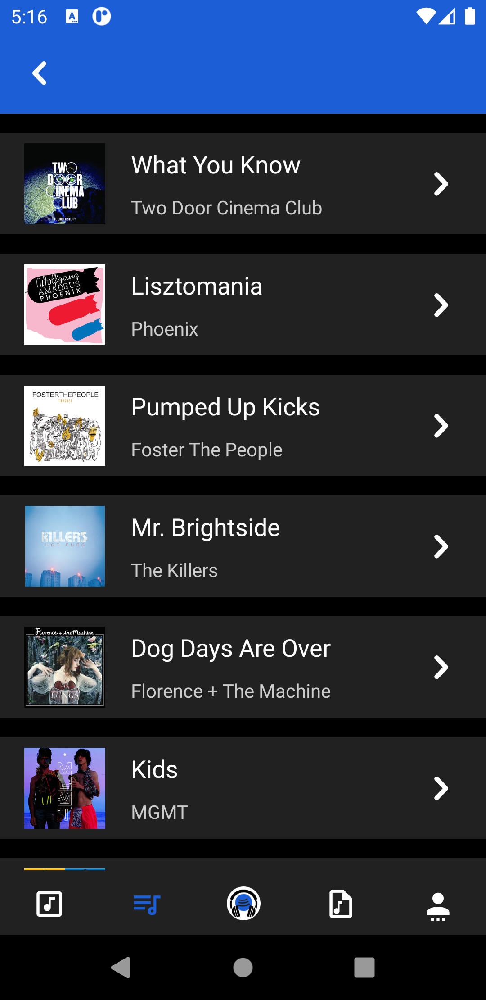
</div>

* Here is where you can search for playlists or access your own (search is done by Spotify)
* All selected playlists will be saved in a history to be re-accessed later
* The playlist details page provides you all the information and the download button
---

### Settings Page


* Where you can log out from Spotify
* And change the path to where the songs are downloaded
---

## Technologies Used

- core
	- JavaScript/TypeScript
	- React Native

- navigation
	- [React Navigation](https://github.com/react-navigation/react-navigation) - used to navigate between the screens

- storage
	- [Async Storage](https://github.com/react-native-async-storage/async-storage) - to save what cases are selected on the `Config Page`
	- [firebase](https://github.com/firebase/firebase-js-sdk) - used to save the Youtube Url (Realtime Database)

- others
	- [react-native-inappbrowser-reborn](https://github.com/proyecto26/react-native-inappbrowser) - used to save access the Spotify Login Page
	- [react-native-ytdl](https://github.com/ytdl-js/react-native-ytdl) - used to download the mp4 video from Youtube
	- [react-native-ffmpeg](https://github.com/tanersener/react-native-ffmpeg) - used to convert mp4 videos downloaded to mp3
	- [react-native-fs](https://github.com/itinance/react-native-fs) - used to save the mp3 files on the chosen path
	- [react-native-vector-icons](https://github.com/oblador/react-native-vector-icons) - used to load the SVGs

---

## License
This project is licensed under the MIT License - see the [LICENSE](../LICENSE) file for details.

