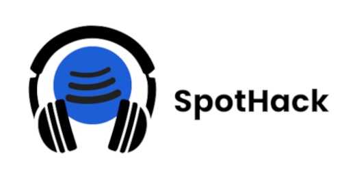
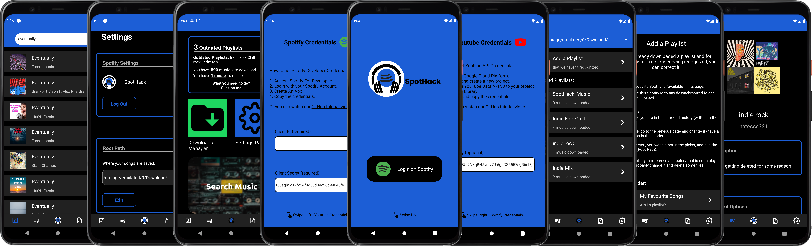
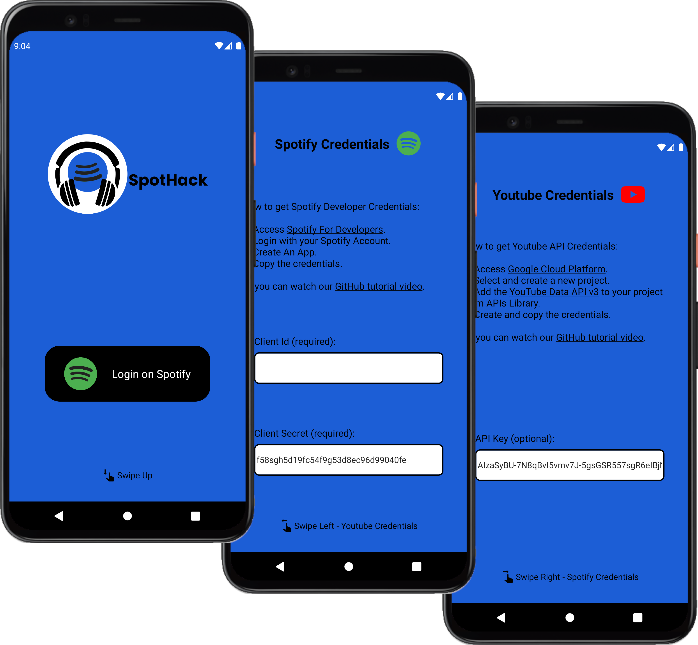
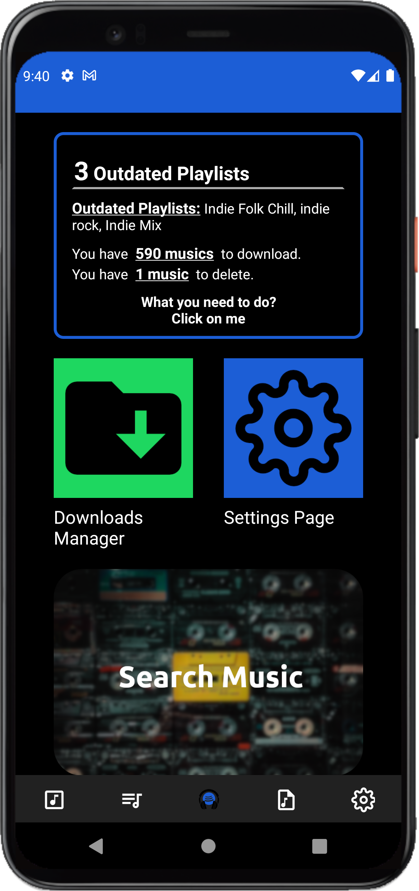
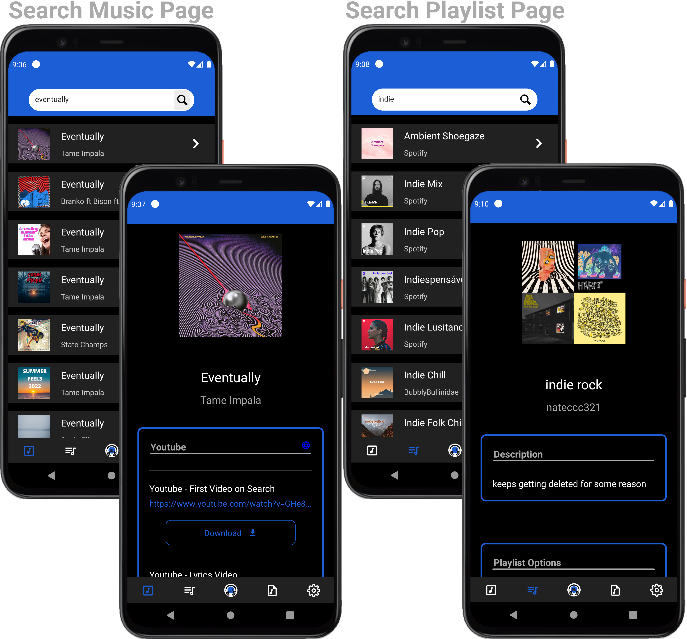
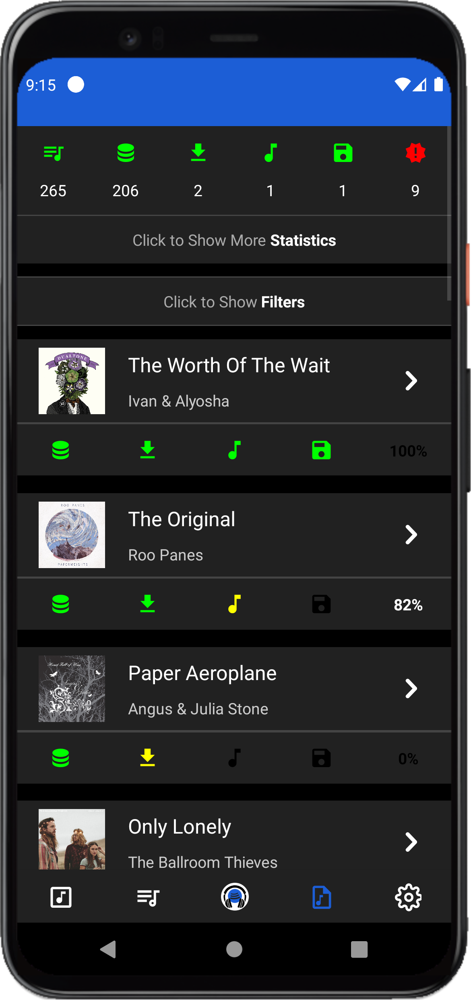
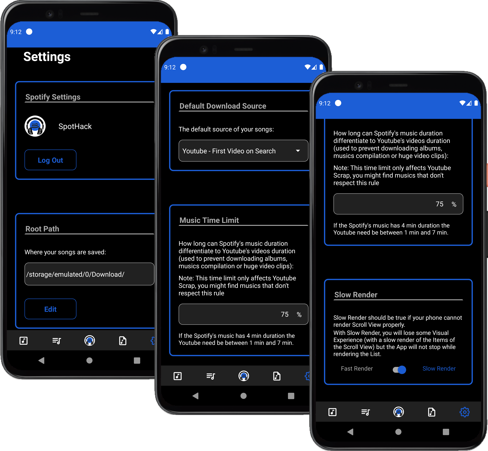
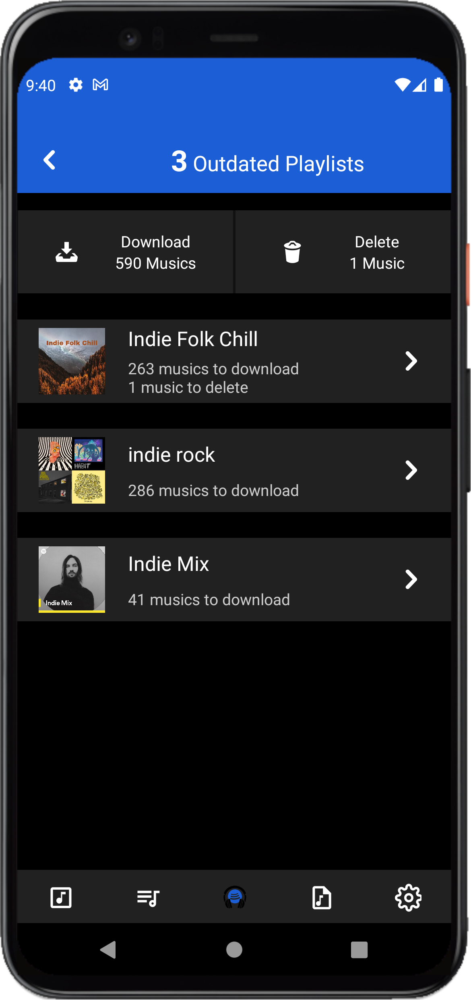
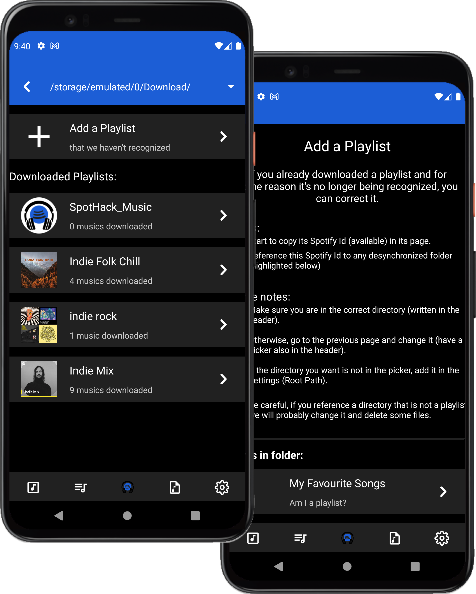

<h1 align="center">
	<a href="https://github.com/Darguima/SpotHack">
		
	</a>
</h1>

<h2 align="center">
	SpotHack
</h2>

<p align="center">
SpotHack is a project where you can convert your Spotify Playlists to .mp3 files in the respective folder. Download your favorites musics and playlists to listen when you are offline. SpotHack is also an open-source project so is possible anyone help since reporting bugs, writing code, documentation, giving ideas or just checking the <a href="https://www.github.com/Darguima/SpotHack">homepage</a>.
</p>

<h4 align="center">
⭐ Don't forget to Starring ⭐
</h4>

<h1 align="center">
		
</h1>

<br/>

## Version 1.1

You are currently in the branch for the V1.1. All the packages (including React Native) were updated (until the last commit). However, we concluded that one crucial package (`react-native-ytdl`) is outdated and doesn't have replacement by now. So this branch is by now paused.

For future references, this are the next steps to conclude the V1.1:

- [ ] Update the `react-native-ytdl` package or find a replacement
- [ ] Reactive `src/SpotHack_Core/DownloadMachine/machineMethods/foregroundService.ts`
- [ ] Check if the `react-native-ffmpeg` is still working (mainly because `FFmpegKit.disableLogs()`)
- [ ] Find a new Youtube Scraper (optional)
- [ ] Improve the DownloadMachine (optional)

## Table of Contents 🗃️

- [Download & Installation](#download--installation-)
- [How it works?](#how-it-works-)
- [Getting Started](#getting-started-)
- [API Credentials](#api-credentials)
- [Pages/Features](#pagesfeatures-)
- [Technologies Used](#technologies-used-)
- [Disclaimer](#-disclaimer-)
- [License](#license-%EF%B8%8F)

## Download & Installation 📥📲

You can download this App in the Releases or build the code with some changes that  you may want.

* [Download APK](https://github.com/Darguima/SpotHack/releases/download/v1.0.1/SpotHack.apk) - (don't forget the [API Credentials](#api-credentials))
* [Download and Build the Code](#getting-started-)
* [Download APK 🔑](https://github.com/Darguima/SpotHack/releases/download/v1.0.1/SpotHackLocked.zip) for my friends - (__need password to install__ 🔒)

###### Note: This project was only developed for Android, no IOS support available;

## How it works? ⚙⚙

After you select your music or playlist our `Download Machine` will, with the [YouTube Scraper](https://github.com/HermanFassett/youtube-scrape) or the [YouTube API](https://developers.google.com/youtube/v3), search for the music video, with the query starting with the artists name followed by the track name. Once we get the YouTube ID we can download the music video and convert it to  `.mp3` with `ffmpeg`.

## Getting Started 🚀

### Prerequisites

- `Git` to clone the repository;

- `Yarn` to install dependencies;

- `Node 18` or newer;

- For run the project you will need the `React Native` Environment configured. You can follow the [ReactNative Official Documentation](https://reactnative.dev/docs/environment-setup#development-os);


##### Cloning

```bash
$ git clone git@github.com:Darguima/SpotHack.git
```

##### Installing Dependencies

```bash
$ yarn
```

##### Set credentials for third-party APIs 🪪

This App use 2 third-party APIs:
* Spotify Api (Web Api)
* Youtube Api (YouTube Data API v3)

You can save this credentials in a `.env` file or input them directly on the App. To get the required credentials you can follow our [tutorial](#api-credentials).

### Setup 🛠️

- To setup the application you can use:

```bash
yarn start
yarn android
```

At this moment you should have a Android Emulator with `SpotHack` running


### Building the APK

#### Generate a KeyStore 🔑

Fill in the required inputs (and remember the password):

```bash
$ keytool -genkey -v -keystore android/app/spothack.keystore -alias spothack -keyalg RSA -keysize 2048 -validity 10000
```

#### Edit the gradle ✏️

Edit the file `android/app/build.gradle`, changing `storePassword` and `keyPassword` to the previous password.

#### Assemble 🧑‍🏭

```bash
cd android
./gradlew assembleRelease
```

###### Based on [this](https://instamobile.io/android-development/generate-react-native-release-build-android/) tutorial.

---

## API Credentials🪪

For store the credentials you can create a file `.env` with the next structure or you can input the credentials directly in the App, on Login Screen.

```env
SPOTIFY_CLIENT_ID= ...
SPOTIFY_CLIENT_SECRET= ...
YOUTUBE_API_KEY= ...
```

### Spotify

As the entire App is based on Spotify's repertoire, it is required have access to their API, or in others words: a `Client Id` and a `Client Secret`. To get this tokens you can follow the next tutorial:

1. Access the [Spotify Developer Dashboard](https://developer.spotify.com/dashboard/).

2. Login with any Spotify Account.

3. Click on `Create App` (name of your choice).

4. Edit the Settings - add `com.darguima.spothack://oauthredirect` to `Redirect URIs`

5. Go to `Users and Access` > `Add new user` and fill in with your users accounts.

6. Now you are able to copy the `Client ID` and the `Client Secret`

https://user-images.githubusercontent.com/49988070/164891563-79bcd7d5-7d0e-417c-b77f-27917792968b.mp4

### YouTube

Unlike Spotify, YouTube API is not essential for the App flow, so you can omit this key without problems, but if for some reason the [`YouTube Scrape` Server](https://github.com/HermanFassett/youtube-scrape) is not working, this can be a plan B for Music Download. To get the `API Key` is a little more complicated than Spotify; Follow the next steps:

1. Access the [Google Cloud Platform Console](https://console.cloud.google.com/getting-started-).

2. Login with any Google Account.

3. Click on `Select a Project` > `New Project`.

4. Create a project with a name of your choice and Select it.

5. Select in `Navigation Menu` > `APIs and services` > `Library`

6. Search and Enable `YouTube Data API v3`

7. Go to `OAuth consent Screen` and select `External` > `Create`, then fill in the required inputs and continue to the end.

8. Go to `Credentials` and click `Create Credentials` > `API key`. Now you can copy the key!

https://user-images.githubusercontent.com/49988070/164891593-d4cd9acc-14b3-428c-a65d-604975ad4a83.mp4

## Pages/Features 📚

### Login Page



* Enter your APIs tokens (if not configured on APK building).
* Login !!

___

### Home Page



* Shortcuts to "Outdated Playlists", "Downloads Manager", "Settings Page" and others ...

___

### Search Pages



* Search for your favorite musics and playlists.
* Download them !!

___

### Download Page



* Follow the download status of your musics.
* Know about the errors.

___

### Settings Page



* Change the "Root Path", "Download Default Source", "Music Time Limit", and the Render Mode.

___

### Outdate Playlist Page



* Follow your playlist Status.
* Download the news musics.
* Delete the old ones.

___

### Add Playlist Page



* Reference a Playlist to a folder, if we can't do it.

___


## Technologies Used 💻

- core ⚛
	- JavaScript/TypeScript
	- React Native

- storage 💾
	- [Async Storage](https://github.com/react-native-async-storage/async-storage) - to save data as settings and histories
	- [react-native-encrypted-storage](https://github.com/emeraldsanto/react-native-encrypted-storage) - to save users' APIs tokens
	- [react-native-dotenv](https://github.com/goatandsheep/react-native-dotenv) - to save my APIs tokens

- download 📥
	- [react-native-ytdl](https://github.com/ytdl-js/react-native-ytdl) - used to download the mp4 video from Youtube
	- [react-native-ffmpeg](https://github.com/tanersener/react-native-ffmpeg) - used to convert mp4 videos downloaded to mp3
	- [react-native-fs](https://github.com/itinance/react-native-fs) - used to save the mp3 files on the chosen path
	- [react-native-foreground-service](https://github.com/voximplant/react-native-foreground-service) - used to keep the download process active even if in background or closed

- others
	- [react-native-inappbrowser-reborn](https://github.com/proyecto26/react-native-inappbrowser) - used to access the Spotify Login Page

---

## 🚨 Disclaimer 🚨

This project can be considered a piracy service to download music. No source code here was used in production, nor was it ever used with the idea of making money. I only disposed of the code as open source because this is a study project. If you want to use it as a service, use it at your own risk, but remember that artists and publishers are likely to own the downloaded music.


## License 👨🏾‍⚖️
This project is licensed under the MIT License - see the [LICENSE](../LICENSE) file for details.
