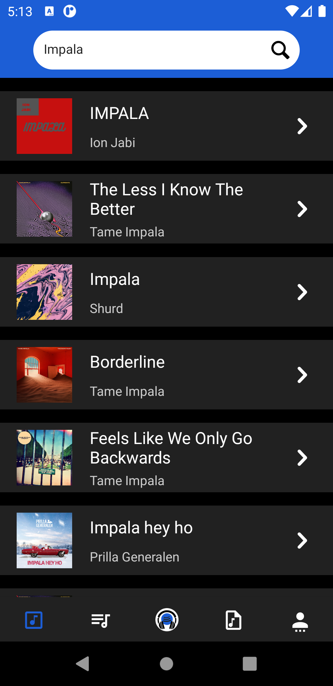
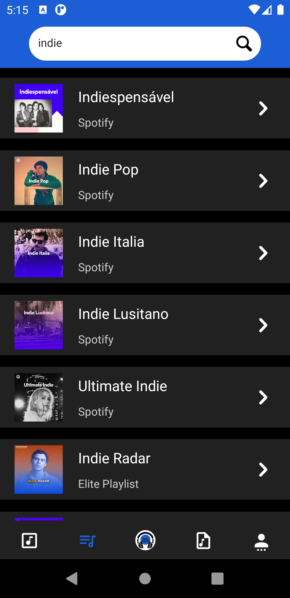
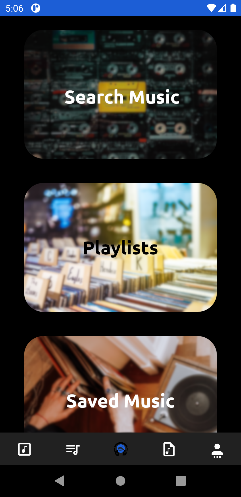
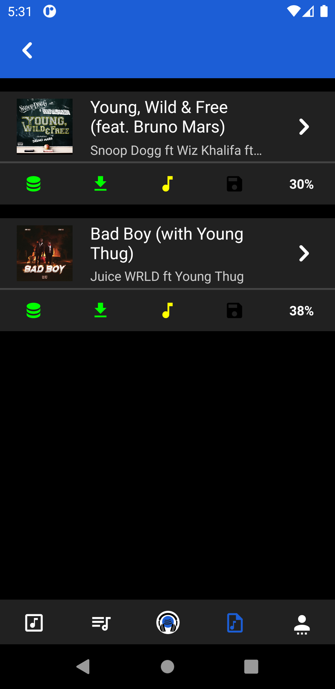
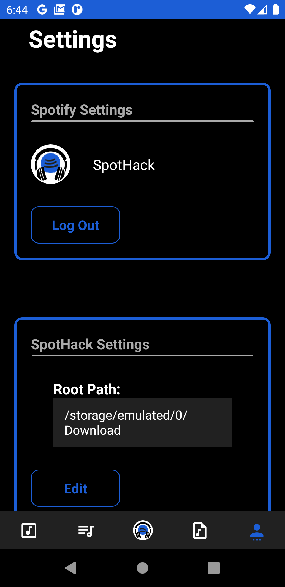

<h1 align="center">
	
</h1>

<h2 align="center">
	SpotHack
</h2>

SpotHack is a project where you can convert your Spotify Playlists to .mp3 files saved in your devices. Download your favorites musics and playlists to listen when you are offline. SpotHack is also an open-source project so is possible anyone help since reporting bugs, writing code, documentation, giving ideas or just checking the <a href="https://www.github.com/Darguima/SpotHack">homepage</a>

 

## Table of Contents

- [Platforms](#platforms)
- [Disclaimer](#disclaimer)
- [License](#license)

---

## Platforms

SpotHack aims to run on several platforms such as Web, Mobile and Desktop. At this moment this is what we have available:

### Android (React Native)

The first variant of SpotHack was written in ReactNative to download your Spotify playlists directly to your phone.

But go deeper and read all the documentation [here](https://github.com/Darguima/SpotHack/tree/main/mobile#readme)

	
	
	
	
	

---

## Disclaimer

This project can be considered a piracy service to download music. No source code here was used in production, nor was it ever used with the idea of making money. I only disposed of the code as open source because this is a study project. If you want to use it as a service, use it at your own risk, but remember that artists and publishers are likely to own the downloaded music.

---

## License

This project is licensed under the MIT License - see the [LICENSE](LICENSE) file for details.
